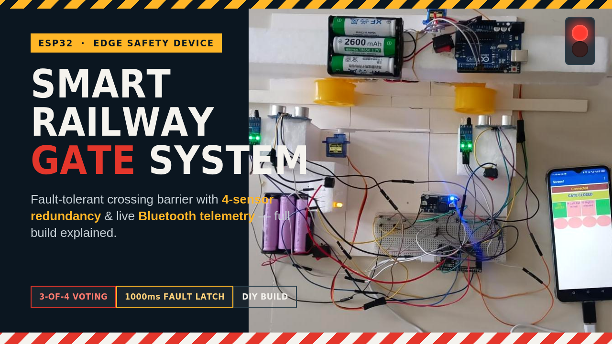
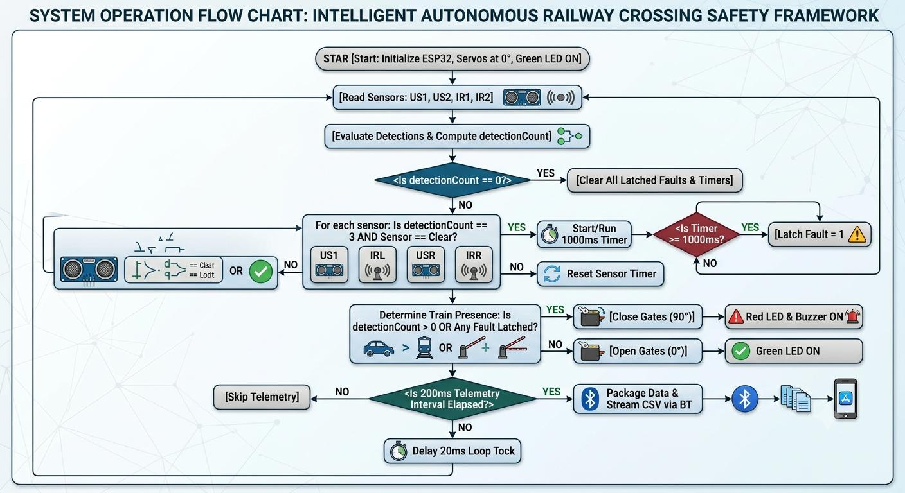
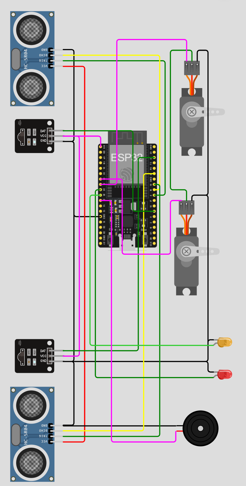
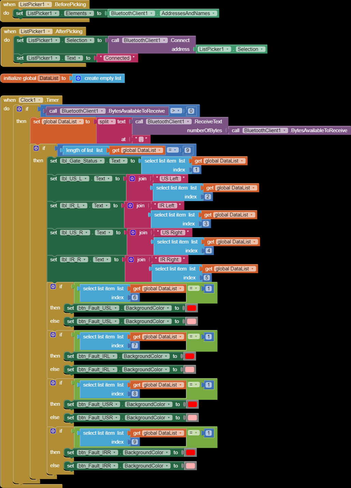
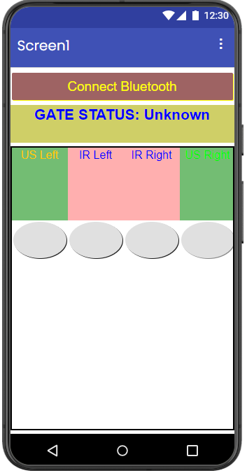
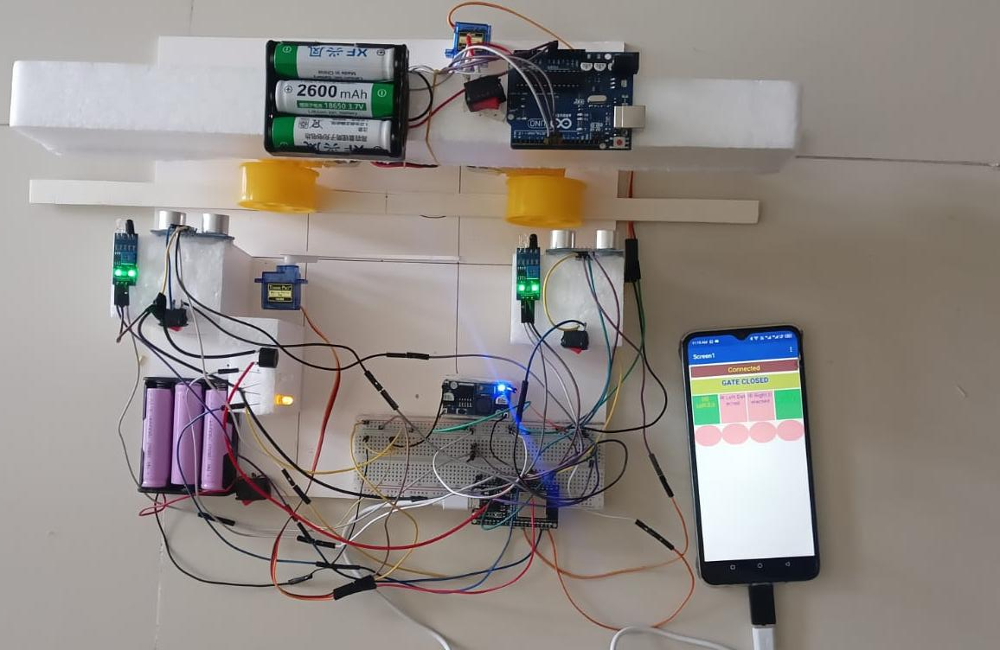
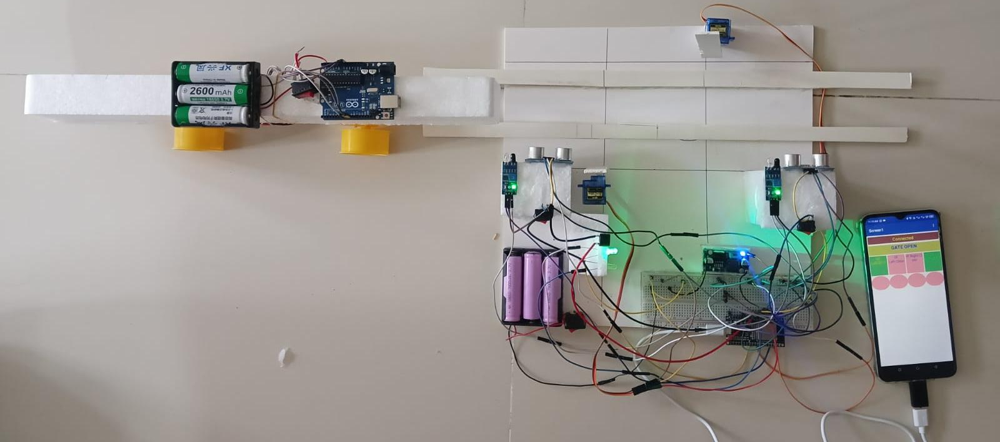

<div align="center">



# 🚦 Smart Railway Gate System

### Intelligent Autonomous Railway Crossing Safety Framework with Multi-Sensor Redundancy

[](https://www.espressif.com/)
[](https://en.wikipedia.org/wiki/C%2B%2B)
[](https://www.arduino.cc/)
[](https://appinventor.mit.edu/)
[](#license)
[](#results)

*A fault-tolerant, edge-computed level-crossing barrier that never fails silently.*

</div>

---

## 📖 Overview

Conventional railway level crossings are a critical weak point in transport infrastructure — delayed gate operations, **single-point sensor failures**, and no remote diagnostics routinely cause accidents. This project replaces the vulnerable single-sensor model with a **heterogeneous, redundant sensor array** and a **3-out-of-4 majority voting algorithm** running on an ESP32, so that the failure of any *one* sensor never leaves the crossing unprotected.

The system doesn't just automate gate closure — it **actively monitors its own hardware health**, latches faults with millisecond precision, and streams live diagnostics to a companion Android app over Bluetooth, turning maintenance from reactive to predictive.

> 📄 Full technical write-up (IEEE format): [`docs/IEEE_Paper.pdf`](docs/IEEE_Paper.pdf)

---

## ✨ Key Features

| | |
|---|---|
| 🛡️ **4-Sensor Redundancy** | Dual ultrasonic (HC-SR04) + dual IR sensors across left/right approaches |
| 🗳️ **3-out-of-4 Voting Logic** | A single sensor dropout never disables protection |
| ⏱️ **1000 ms Fault Latching** | Temporal confirmation window before a fault is permanently flagged |
| 🚧 **Dual Servo Barriers** | Synchronized 0°↔90° gate actuation, closes in **< 20 ms** |
| 🔊 **Visual + Audible Alerts** | Red/Green LEDs and piezo buzzer for physical warning |
| 📡 **Live Bluetooth Telemetry** | 5 Hz CSV data stream (distances, states, faults, gate position) |
| 📱 **Mobile Supervisory App** | Built in MIT App Inventor — live gate status + per-sensor fault indicators |

---

## 🧠 How It Works

The ESP32 continuously reads all four sensors and computes a `detectionCount`. If exactly 3 of 4 sensors agree while one reports "clear," a 1000 ms timer starts for that sensor — if it doesn't recover, its fault flag latches permanently, and the gate is held closed regardless of that sensor's readings for the remainder of the transit.

<div align="center">


*Fig. 1 — Core decision loop: sense → vote → confirm faults → actuate → stream telemetry.*
</div>

---

## 🔧 Hardware & Wiring

<div align="center">


*Fig. 2 — Sensor–controller–actuator wiring on the ESP32-WROOM-32.*
</div>

### Pin Map

| Signal | GPIO | Purpose |
|---|---|---|
| `trigPin1` / `trigPin2` | 5 / 19 | Ultrasonic trigger (10 µs pulse) |
| `echoPin1` / `echoPin2` | 34 / 35 | Ultrasonic echo (input-only, 5V-safe) |
| `irPin1` / `irPin2` | 22 / 36 | IR obstacle detection (digital) |
| `servoPin1` / `servoPin2` | 32 / 33 | PWM — left/right barrier servos |


## ⚙️ System Parameters

| Parameter | Value | Purpose |
|---|:---:|---|
| Distance Threshold | 10.0 cm | Max. ultrasonic trigger distance |
| `FAULT_CONFIRM_MS` | 1000 ms | Fault confirmation window |
| `txInterval` | 200 ms | Bluetooth telemetry rate (5 Hz) |
| Pulse Timeout | 30000 µs | `pulseIn()` upper bound (prevents lockups) |

---

## 📱 Mobile Supervisory App

Built with **MIT App Inventor**, the companion app connects over Bluetooth Serial, parses the incoming CSV telemetry packet on a timer tick, and renders live gate status alongside a per-sensor fault indicator grid.

<table>
<tr>
<td width="50%"></td>
<td width="50%"></td>
</tr>
<tr>
<td align="center"><sub>Fig. 3 — App Inventor block logic</sub></td>
<td align="center"><sub>Fig. 4 — Live monitoring interface</sub></td>
</tr>
</table>

---

## 📊 Results

<table>
<tr>
<td width="50%"></td>
<td width="50%"></td>
</tr>
<tr>
<td align="center"><sub>Fig. 5 — Gate closed on train detection</sub></td>
<td align="center"><sub>Fig. 6 — Gate re-opens after the train clears</sub></td>
</tr>
</table>

| Scenario | Detection Count | Fault Vector | Gate | Latency |
|---|:---:|:---:|:---:|:---:|
| Idle track | 0 | 0,0,0,0 | Open | < 5 ms |
| Nominal train entry | 4 | 0,0,0,0 | Closed | < 20 ms |
| Single-sensor dropout (window) | 3 | 0,0,0,0 | Closed | 1 ms *(timer starts)* |
| Single-sensor dropout (latched) | 3 | 1,0,0,0 | Closed | ≥ 1000 ms |
| Train exit / reset | 0 | 0,0,0,0 | Open | < 20 ms |

✅ **Zero downtime** during simulated single-sensor failures — the redundancy layer fully eliminates single-point-of-failure vulnerabilities.

---

## 🚀 Getting Started

### Prerequisites
- [Arduino IDE](https://www.arduino.cc/en/software) with the **ESP32 board package** installed
- Libraries: [`ESP32Servo`](https://github.com/madhephaestus/ESP32Servo), `BluetoothSerial` (bundled with ESP32 core)
- [MIT App Inventor](https://appinventor.mit.edu/) (optional, to modify the mobile app)

### Flash the Firmware
```bash
git clone https://github.com/<your-username>/smart-railway-gate-system.git
cd smart-railway-gate-system/firmware
# Open smart_railway_gate.ino in Arduino IDE
# Select Board: "ESP32 Dev Module"  →  Select correct COM port  →  Upload
```

### Wire the Hardware
Follow the pin map above and the wiring diagram in `assets/circuit_diagram.png`.

### Pair & Monitor
1. Power on the ESP32 — it advertises as **`SmartRailwayGate`** over Bluetooth.
2. Open the companion app (or any Serial Bluetooth Terminal) and connect.
3. Watch live gate status and per-sensor fault flags update in real time.

---

## 📂 Repository Structure

```
smart-railway-gate-system/
├── firmware/
│   └── smart_railway_gate.ino     # ESP32 source (3-of-4 voting + telemetry)
├── assets/                        # Diagrams, screenshots, thumbnail
├── docs/
│   └── IEEE_Paper.pdf             # Full technical report (IEEE format)
└── README.md
```

---

## 🔭 Future Scope

- 📶 Long-range monitoring via **LTE-M / NB-IoT / LoRaWAN**
- ☀️ Solar power + battery management for off-grid deployment
- 🎥 Camera-based computer vision to detect vehicles trapped on the crossing
- 🧠 Predictive maintenance algorithms to flag sensor degradation *before* failure

---

## 👤 Author

**Md. Imran Hossain Emon**
Dept. of Electrical & Electronic Engineering, Rajshahi University of Engineering & Technology (RUET)

Supervised by **Md. Rakibul Islam**, Lecturer, Dept. of EEE, RUET
*Course: EEE 3100 — Electronics Shop Practice*

## 📄 License

This project is released under the [MIT License](LICENSE).

<div align="center">

⭐ *If this project helped you, consider giving it a star!* ⭐

</div>
